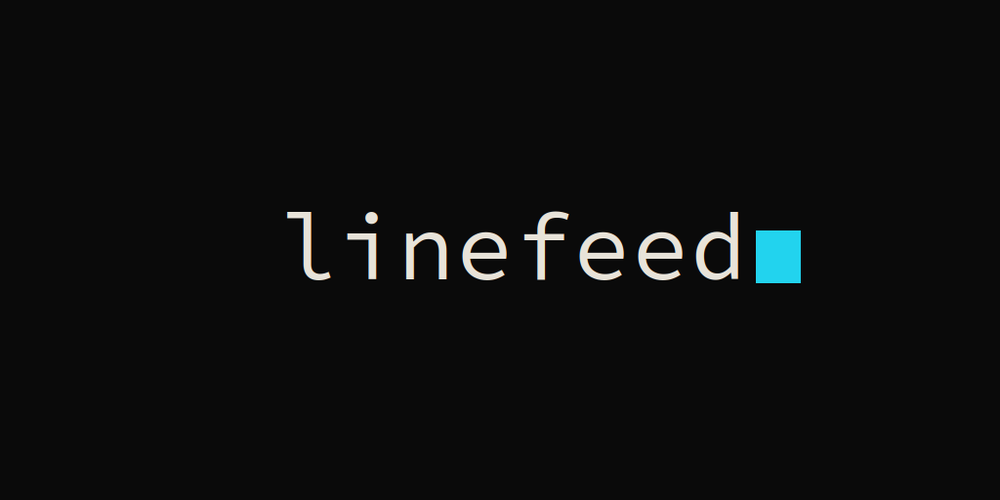

<p align="center">
  
  <br/>
  
</p>

# Linefeed

An open-source teleprompter that scrolls as you speak. Speech recognition and
script alignment run offline on your machine — no cloud, no accounts, no
uploaded audio.

## Why

Teleprompters that follow your voice usually mean vendor accounts, per-minute
cloud ASR, and your voice shipped to someone else's servers. Linefeed is
local-first by construction: recognition, alignment, and rendering all run on
your machine. Free forever — Apache-2.0, models on disk, nothing to renew.

## Features

- Voice-following scroll with a line highlight on the words you're reading
- Portuguese (pt-BR) and English speech models, downloadable in-app
- Reading zone: a resizable centered box the text scrolls inside
- Configurable lookahead (`[` / `]`): how many upcoming lines stay visible
- Reading font picker: Inter, Atkinson Hyperlegible (low-vision), Source
  Sans 3, Noto Sans, Georgia, system default
- Mirroring (horizontal / vertical) for beam-splitter and glass setups
- Dumb-scroll fallback: constant-speed scroll with no microphone at all
- Presentation mode: `h` hides every control until you bring it back
- Session diagnostics (`Cmd/Ctrl+D`): tracker events + mic levels as JSONL
- CLI with deterministic replay (`replay`), live mic (`live`), device
  listing (`devices`) and timeline recording (`dump`) — the same alignment
  core as the GUI
- Linux and macOS; works fully offline at runtime

## How it works

- A streaming ASR engine runs on-device (sherpa-onnx) and emits word
  hypotheses with timestamps.
- An anchored-cursor + banded-DP aligner maps each hypothesis onto the
  script's token stream in real time; ad-libs hold position, skips catch up,
  rereads backtrack. Alignment is token-index-only — never keyed to font
  size, visible-word counts, or rendering metrics.
- The renderer keeps the spoken line at the reading anchor and glides the
  scroll target with the configured lookahead.

No cloud anywhere in that chain. Audio never leaves the machine; ASR models
live on your disk and are not part of the repo.

## Layout

```
crates/linefeed-core   pure alignment (no audio, no UI, no deps)
crates/linefeed-asr    AsrEngine trait, sherpa engine, model registry, mic
crates/linefeed-cli    binary `linefeed`: replay / live / devices / dump
crates/linefeed-gui    Tauri v2 app (Rust backend + TS/Vite frontend)
```

## Install and quickstart

### GUI (Tauri)

```bash
cd crates/linefeed-gui
npm install
npx tauri dev
```

On first run the splash offers to download the speech model for your
selected language (pt-BR ~99 MB, English ~158 MB); both can also be
installed later from the settings panel. Declining is fine — dumb scroll
works without any model. On Linux without system webkit2gtk dev packages,
source `scripts/dev-env.sh` first.

### CLI

```bash
cargo build --release

# deterministic replay of a 16 kHz mono WAV:
./target/release/linefeed replay script.txt --wav take.wav

# live microphone (devices lists inputs; --model en for English):
./target/release/linefeed devices
./target/release/linefeed live script.txt --input-device 1 --dump-timeline take.jsonl
```

Models install to the platform data dir (override with
`LINEFEED_MODELS_DIR`); the GUI downloads them for you, or use the same
URLs from the model registry (`crates/linefeed-asr/src/models.rs`).

## Keyboard shortcuts

| Key | Action |
|-----|--------|
| `h` | Presentation mode — hide all controls (`h` / `Esc` / resting the pointer on the bottom edge brings them back) |
| `f` | Resume auto-follow after a manual scroll |
| `F11` / `Cmd+F` / `Ctrl+F` | Toggle fullscreen |
| `[` / `]` | Lookahead lines down / up |
| `Alt+←/→` | Reading-zone width down / up |
| `Alt+↑/↓` | Reading-zone height down / up |
| `Cmd/Ctrl+D` | Toggle session diagnostics (applies from next session start) |
| `Space` | Play / pause (dumb-scroll mode only) |
| `Cmd/Ctrl+O` | Open a script |

## Status

Alpha, actively developed. The alignment core is validated end-to-end on
recorded pt-BR takes (clean, noisy, ad-lib, and skip-around: final cursor
100% of script tokens). This codebase is a from-scratch rewrite of the
original implementation, carrying its validated algorithm design forward
while fixing the first version's known flaws at the architecture level.

## License

Apache-2.0 — see [`LICENSE`](LICENSE).

Fonts, all SIL Open Font License 1.1 (licenses ship alongside each family
in `crates/linefeed-gui/src/assets/fonts/`):

- [SauceCodePro Nerd Font](https://www.nerdfonts.com/) — brand mono (controls, accents, wordmark)
- [Inter](https://rsms.me/inter/) — default reading face
- [Atkinson Hyperlegible](https://atkinsonhyperlegiblefont.com/) — low-vision reading face
- [Source Sans 3](https://github.com/adobe-fonts/source-sans)
